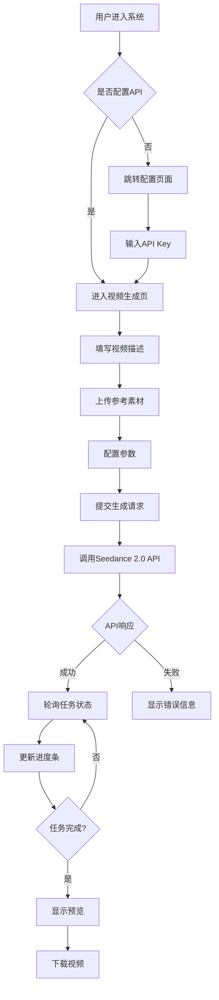

# 产品需求文档 (PRD) - Seedance AI 视频生成平台

## 1. 产品概述
基于火山引擎 Seedance 2.0 模型的 AI 视频生成平台，支持文字描述和参考素材上传生成高质量视频内容。面向内容创作者、营销团队和视频制作人员，提供直观的视频生成体验。

- **核心功能**：文字/图片转视频、多模态输入支持、生成进度追踪
- **目标价值**：降低视频制作门槛，提升创作效率，实现创意快速落地

## 2. 核心功能

### 2.1 用户角色
| 角色 | 认证方式 | 核心权限 |
|------|---------|----------|
| 普通用户 | API Key 配置 | 创建视频任务、查看历史记录、下载生成结果 |
| 管理员 | 系统登录 | 任务管理、API 配置监控 |

### 2.2 功能模块
1. **主页/工作台**：品牌展示、快速入口、功能介绍
2. **视频生成页**：文字输入区、文件上传区、参数配置面板、生成控制
3. **任务管理页**：任务列表、状态显示、预览与下载
4. **历史记录页**：已完成的视频作品库、搜索与筛选

### 3. 页面详情

#### 3.1 主页 (Home)
| 模块名称 | 功能描述 |
|----------|----------|
| Hero 区域 | 品牌标语、动态背景效果、立即使用按钮 |
| 功能特性 | 核心能力展示卡片（文生视频、图生视频、多模态融合） |
| 使用流程 | 三步走引导：输入描述 → 上传资料 → 生成视频 |
| 作品展示 | 示例视频轮播或静态展示 |

#### 3.2 视频生成页 (Create)
| 模块名称 | 功能描述 |
|----------|----------|
| 输入区域 | 多行文本框用于输入视频描述提示词 |
| 文件上传 | 支持拖拽/点击上传图片或参考视频文件（支持多文件） |
| 参数配置 | 视频时长、分辨率、风格选择、种子值等 |
| 预览设置 | 宽高比选项（16:9、9:16、1:1）|
| 操作按钮 | 生成按钮（带loading态）、重置表单 |
| 进度显示 | 实时进度条、预估时间、当前阶段说明 |

#### 3.3 任务管理页 (Tasks)
| 模块名称 | 功能描述 |
|----------|----------|
| 任务列表 | 表格形式展示所有任务（ID、状态、时长、创建时间）|
| 状态标签 | 排队中/处理中/已完成/失败，不同颜色标识 |
| 快速操作 | 查看详情、取消任务、重新生成 |
| 批量操作 | 批量删除已完成任务 |

#### 3.4 历史记录页 (History)
| 模块名称 | 功能描述 |
|----------|----------|
| 视频网格 | 缩略图瀑布流/网格布局展示已生成视频 |
| 详情弹窗 | 点击查看大图预览、播放视频、下载、查看参数 |
| 搜索筛选 | 按日期、关键词、状态筛选 |
| 分页加载 | 无限滚动或分页器 |

## 4. 核心业务流程

### 4.1 视频生成主流程
```
用户访问 → 配置 API Key → 进入创建页面 
→ 输入文字描述（必填）
→ [可选] 上传参考图片/视频文件 
→ 调整生成参数（分辨率、时长等）
→ 点击"生成视频"
→ 显示进度（排队 → 处理中 → 渲染完成）
→ 预览并下载结果
```

### 流程图



## 5. 用户界面设计

### 5.1 设计风格
**整体定位**：科技感 + 专业工具美学
- **主色调**：深空蓝 (#0a0f1c) 作为背景，电光蓝 (#00d4ff) 作为主强调色，翠绿 (#00ff88) 作为成功状态色
- **辅助色**：暖橙 (#ff6b35) 用于警告和重要操作，柔和紫 (#a855f7) 作为次要强调
- **按钮风格**：圆角胶囊状（border-radius: 24px），带有微妙的渐变边框和悬停发光效果
- **字体**：
  - 标题字体：Space Grotesk（技术感、现代）
  - 正文字体：DM Sans（清晰易读）
- **布局风格**：居中单栏布局为主，卡片式模块划分，大量留白营造专业感
- **图标风格**：线性图标（Lucide Icons），细线条描边
- **视觉特效**：
  - 背景采用深色渐变 + 动态噪点纹理
  - 卡片使用毛玻璃效果（glassmorphism）
  - 微妙的动画过渡和悬停反馈

### 5.2 各页面UI设计概要

| 页面 | 模块 | UI元素 |
|------|------|--------|
| 主页 | Hero区域 | 全屏高度、动态粒子/流体背景、大标题+副标题、CTA按钮带脉冲动画 |
| 主页 | 特性卡片 | 3列网格、悬浮上升效果、图标+标题+描述结构 |
| 生成页 | 输入区 | 大尺寸文本框、placeholder提示、字数统计 |
| 生成页 | 上传区 | 虚线边框拖放区、文件列表预览、类型限制提示 |
| 生成页 | 参数面板 | 折叠式分组、滑块控件、下拉选择器 |
| 生成页 | 进度区 | 圆形进度环或线形进度条、百分比数字、阶段文字 |
| 任务页 | 列表 | 斑马纹表格、状态徽章、操作按钮组 |
| 历史页 | 网格 | Masonry瀑布流或等距网格、悬浮显示信息遮罩 |

### 5.3 响应式策略
- **桌面优先**（≥1200px）：完整三栏布局
- **平板适配**（768px-1199px）：双栏布局，侧边栏可折叠
- **移动端**（<768px）：单栏堆叠布局，触控优化按钮尺寸≥44px

## 6. 关键交互细节

### 6.1 文件上传交互
- 支持拖拽到指定区域自动触发上传
- 点击区域弹出系统文件选择对话框
- 支持 JPG/PNG/WebP 图片格式和 MP4/MOV 视频格式
- 单个文件大小限制 20MB
- 最多同时上传 5 个参考文件
- 上传后显示缩略图预览，可单独删除

### 6.2 生成过程反馈
- 提交后按钮变为 loading 状态，禁用重复点击
- 显示预估等待时间
- 实时更新进度百分比
- 支持取消正在排队的任务
- 完成时有视觉提示（动画+音效可选）

### 6.3 错误处理
- API Key 未配置时给出明确指引
- 网络超时提供重试机制
- API 返回错误信息友好翻译显示
- 文件格式不支持即时提示
